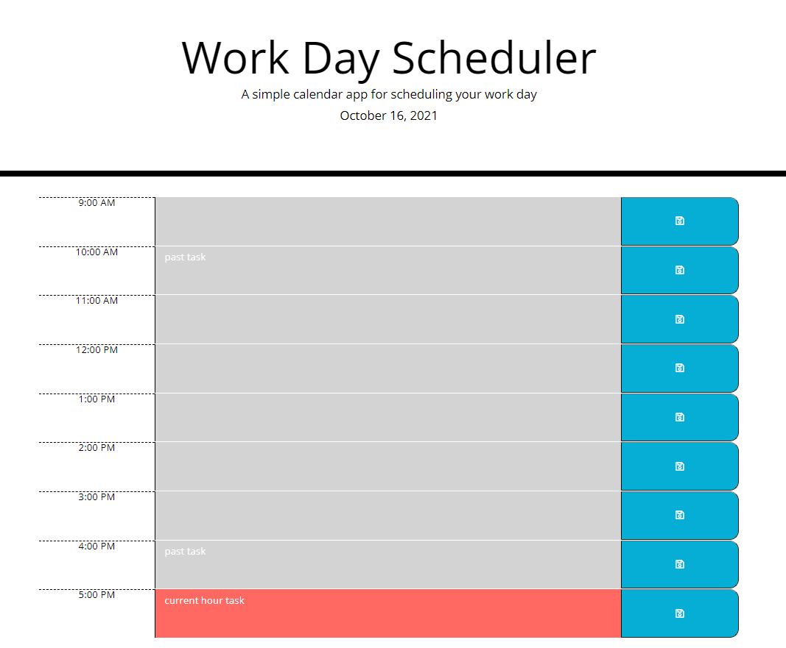

# work-day-scheduler

## Purpose

An application in which a user can schedule tasks for their workday in hour increment blocks. 

## Technologies
- HTML
- CSS
- JavaScript

With the following APIs:
- jQuery
- Bootstrap
- moment.js

## Website
https://kngurley25.github.io/work-day-scheduler/

## Image
